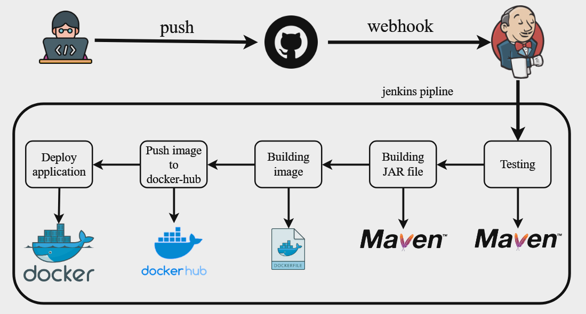

# Jenkins Pipeline for Maven-based Java Application Deployment

This Jenkins pipeline automates the build, test, and deployment process of a Maven-based Java application as a Docker container.

## Features

- **Build & Test**: Runs Maven tests and packages the application into a JAR file.
- **Docker Image**: Builds a Docker image (`maven-app`) from the JAR file.
- **Docker Hub**: Pushes the Docker image to Docker Hub for centralized storage.
- **Deployment**: Deploys the application as a Docker container, accessible on port 8090.

## Requirements

- Jenkins with necessary plugins (Pipeline, Credentials).
- Docker installed on the Jenkins agent.
- Docker Hub account with credentials configured in Jenkins.

## Setup

1. **Jenkins Configuration**:
   - Configure Jenkins Global Tool Configuration for Maven.
   - Add Docker Hub credentials (`docker-hub`) with username and password.

2. **Pipeline Setup**:
   - Create a new Jenkins pipeline job.
   - Copy and paste the provided Jenkinsfile into the pipeline script section.

## Usage

1. **Run the Pipeline**:
   - Trigger the pipeline manually or via webhook upon code commits.
   - Monitor the Jenkins job console for build, test, and deployment logs.

2. **Access the Deployed Application**:
   - Once deployed, access the application in a web browser at `http://<Jenkins-server>:8090`.

## Troubleshooting

- Ensure Docker and Jenkins configurations are correctly set up.
- Check Jenkins logs for any pipeline execution errors.
